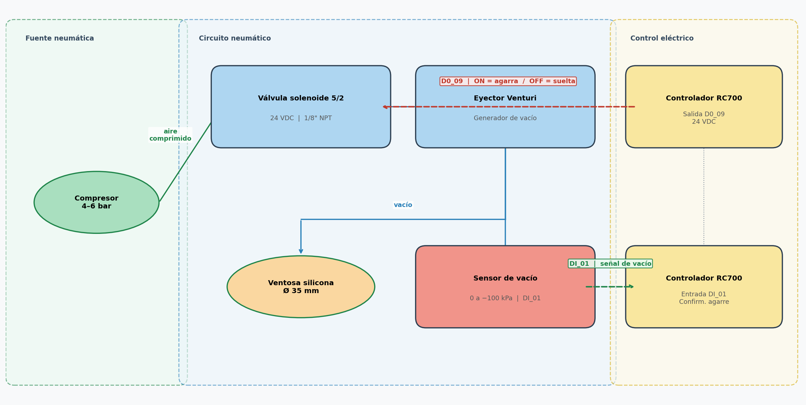
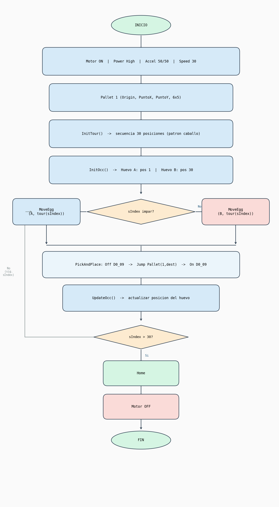

# Laboratorio No. 03 — Robótica Industrial 2026-I
## Análisis y Operación del Manipulador EPSON T3-401S

**Asignatura:** Robótica Industrial  
**Semestre:** 2026-I  
**Integrantes:** Luis Alberto Mendoza Rojas — Duvan Tique  
**Repositorio:** https://github.com/lmendozar2001/RoboticaLab3

---

## 1. Comparación entre manipuladores

Para este laboratorio se compararon tres robots industriales: el Motoman MH6, el ABB IRB140 y el EPSON T3-401S. La diferencia más notable es que el EPSON es un robot tipo SCARA con solo 4 grados de libertad, mientras que los otros dos son robots articulados con 6. Esto hace que el EPSON sea más limitado en orientación, pero mucho más rápido y preciso para tareas en un plano horizontal como el paletizado.

| Característica | Motoman MH6 | ABB IRB140 | EPSON T3-401S |
|---|---|---|---|
| **Tipo** | Articulado (6 DOF) | Articulado (6 DOF) | SCARA (4 DOF) |
| **Carga máxima** | 6 kg | 6 kg | 3 kg |
| **Alcance máximo** | 1 422 mm | 810 mm | 400 mm |
| **Grados de libertad** | 6 | 6 | 4 |
| **Velocidad máx. TCP** | 2 000 mm/s | 2 500 mm/s | 5 100 mm/s |
| **Repetibilidad** | ±0.08 mm | ±0.01 mm | ±0.01 mm |
| **Peso del robot** | 130 kg | 98 kg | 12 kg |
| **Controlador** | DX100 / YRC1000 | IRC5 | RC700 / RC90 |
| **Software** | MotoSim / MotoPlus | RobotStudio | EPSON RC+ 7.0 |
| **Aplicaciones típicas** | Soldadura, manipulación, ensamble | Ensamble, pick & place, soldadura | Pick & place, ensamble de precisión, paletizado |
| **Comunicación** | EtherNet/IP, DeviceNet | EtherNet/IP, PROFIBUS | USB, Ethernet, E/S digitales |

El Motoman MH6 y el ABB IRB140 son robots más grandes y pesados, pensados para entornos industriales exigentes como soldadura o ensamble de piezas grandes. El EPSON T3-401S en cambio es compacto y liviano, lo que lo hace ideal para laboratorio y para tareas repetitivas de pick & place donde no se necesita mucha carga ni alcance.

---

## 2. Posición Home del EPSON T3-401S

La posición Home es básicamente el punto de partida del robot, desde donde arranca y al que vuelve al terminar. En el EPSON T3-401S hay dos formas de definirla:

- **Home mecánico:** es una posición física marcada en el robot, que se usa cuando se necesita recalibrar el equipo.
- **Home de usuario:** es la que se define en el software RC+ 7.0 con el comando `Home`. Esta es la que usamos en el laboratorio, y el robot la ejecuta al inicio y al final de cada programa para quedar en una posición segura.

En esa posición, todas las articulaciones quedan en 0° y el eje Z sube hasta su posición más alta:

| Articulación | Descripción | Posición en Home |
|---|---|---|
| **J1** | Rotación de la base | 0° |
| **J2** | Rotación del brazo | 0° |
| **J3** | Eje vertical (traslación) | Posición más alta |
| **J4** | Rotación de la muñeca | 0° |

---

## 3. Movimientos manuales

Para mover el robot manualmente se usa el software EPSON RC+ 7.0 en modo jog. Hay dos modos principales:

### 3.1 Cambio de modo

| Tecla | Función |
|---|---|
| **F1 / Joint** | Mueve articulación por articulación |
| **F2 / World** | Mueve el robot en coordenadas X, Y, Z del mundo |
| **F3 / Tool** | Mueve relativo a la herramienta |
| **F4 / Local** | Mueve relativo a un sistema de coordenadas local |

### 3.2 Modo articulaciones (Joint)
Cada tecla mueve una sola articulación:
- **J1+/J1−**: gira la base.
- **J2+/J2−**: mueve el segundo eslabón.
- **J3+/J3−**: sube o baja el eje Z.
- **J4+/J4−**: gira la muñeca.

### 3.3 Modo cartesiano (World)
El robot se mueve en línea recta siguiendo los ejes del espacio:
- **X+/X−**, **Y+/Y−**: movimiento horizontal.
- **Z+/Z−**: movimiento vertical.
- En el SCARA solo aplica rotación en Z (Rz), a diferencia de los robots de 6 DOF que pueden rotar en los tres ejes.

---

## 4. Velocidades para movimiento manual

El robot tiene varios niveles de velocidad para el jog manual. Esto es útil porque cuando se está cerca de un objeto hay que ir despacio para no golpear nada, y cuando el espacio está libre se puede ir más rápido.

| Nivel | Velocidad aprox. | Cuándo usarlo |
|---|---|---|
| **Low** | ~1% | Cuando se está muy cerca de la cubeta o de un objeto |
| **Medium** | ~10–30% | Para ajustes generales |
| **High** | ~50–100% | Cuando hay espacio libre |

Para cambiar la velocidad se usan las teclas **Speed+** y **Speed−** en el Teach Pendant, o el slider en la interfaz de RC+ 7.0. El nivel activo se ve en la barra de estado como un porcentaje.

En el laboratorio usamos velocidad baja al principio para definir los puntos del pallet sin riesgo de golpear la cubeta, y luego subimos un poco para las pruebas de la rutina.

---

## 5. Software EPSON RC+ 7.0

### 5.1 ¿Qué hace?

RC+ 7.0 es el programa con el que se programa y controla el robot EPSON. Lo que más usamos en el laboratorio fue:

- **Editor SPEL+**: donde se escribe el código del robot. El lenguaje es bastante directo, con comandos como `Jump`, `On`, `Off`, `Home`.
- **Simulador 3D**: antes de correr el programa en el robot real, lo simulamos aquí para verificar que la trayectoria fuera correcta y no hubiera colisiones.
- **Panel de jog**: para mover el robot manualmente y enseñarle los puntos del pallet.
- **Monitor de E/S**: para ver en tiempo real si la salida D0_09 del gripper estaba activa o no.
- **Herramienta Pallet**: con solo tres puntos (origen, X y Y) el software calcula automáticamente las 30 posiciones de la cubeta. Eso simplificó bastante la programación.

### 5.2 ¿Cómo se comunica con el robot?

La conexión fue por USB directamente al controlador RC700. El flujo es:
1. Se escribe el programa en RC+ 7.0.
2. El software lo compila y lo manda al controlador.
3. El controlador genera las señales para los motores de cada articulación.
4. Los encoders del robot mandan de vuelta la posición real, cerrando el lazo de control.
5. RC+ 7.0 muestra el estado del robot en tiempo real.

---

## 6. Comparación: RC+ 7.0 vs RoboDK vs RobotStudio

| Característica | EPSON RC+ 7.0 | RoboDK | RobotStudio |
|---|---|---|---|
| **Fabricante** | EPSON | RoboDK Inc. | ABB |
| **Robots compatibles** | Solo EPSON | Multimarca | Solo ABB |
| **Lenguaje** | SPEL+ | Python / scripts | RAPID |
| **Simulación 3D** | Sí | Sí (avanzada) | Sí (muy avanzada) |
| **Detección de colisiones** | Básica | Sí | Sí |
| **Costo** | Gratis con el robot | De pago | Gratis con el robot |
| **Facilidad de uso** | Media | Fácil-Media | Media-Alta |

Desde nuestra experiencia en el laboratorio, RC+ 7.0 es bastante directo para lo que necesitábamos. La herramienta de pallet y el simulador integrado funcionaron bien. RoboDK nos parece más útil cuando se trabaja con varios robots de distintas marcas porque genera código para todos. RobotStudio es más completo en simulación pero está limitado a robots ABB, igual que RC+ 7.0 está limitado a EPSON.

---

## 7. Gripper neumático por vacío

### 7.1 ¿Cómo funciona?

El gripper usa una ventosa de silicona que se pega al huevo por vacío. Cuando la salida D0_09 del robot se activa, la válvula solenoide abre el paso de aire al eyector Venturi, que genera el vacío y hace que la ventosa agarre el huevo. Cuando se desactiva, el vacío se corta y el huevo queda libre.

### 7.2 Componentes

| Componente | Especificación | Para qué sirve |
|---|---|---|
| **Ventosa de silicona** | Ø 30–40 mm, copa blanda | Contacto con el huevo |
| **Eyector Venturi** | 4–6 bar | Genera el vacío |
| **Válvula solenoide 5/2** | 24 VDC, 1/8" | Controla cuándo hay vacío |
| **Sensor de vacío** | 0 a −100 kPa | Confirma que el huevo fue agarrado |
| **Tubería neumática** | Ø 4 mm | Conduce el aire |
| **Soporte de montaje** | Aluminio | Fija todo al flange del robot |

### 7.3 Señales digitales usadas

En el laboratorio se utilizó únicamente la salida digital `D0_09` para controlar la válvula solenoide del gripper. La entrada `DI_01` (sensor de confirmación de vacío) no se conectó durante la práctica.

| Señal | Función |
|---|---|
| **D0_09 (salida)** | ON = agarra el huevo / OFF = suelta |

```spel
On D0_09    ' activa el vacío, agarra el huevo
Off D0_09   ' corta el vacío, suelta el huevo
```

### 7.4 Diagrama del sistema



---

## 8. Trayectoria con patrón de caballo de ajedrez

### 8.1 El problema

La cubeta tiene 30 posiciones (6 columnas × 5 filas). Los dos huevos de plástico empiezan en los extremos opuestos: el huevo A en la posición 1 (esquina superior izquierda) y el huevo B en la posición 30 (esquina inferior derecha). La rutina los mueve alternadamente por todas las posiciones de la cubeta, pero con la restricción de que cada movimiento tiene que seguir el patrón del caballo en ajedrez: 2 casillas en una dirección y 1 en la perpendicular.

### 8.2 Distribución de la cubeta

```
     Col1  Col2  Col3  Col4  Col5  Col6
Fil1 [ 1]  [ 2]  [ 3]  [ 4]  [ 5]  [ 6]
Fil2 [ 7]  [ 8]  [ 9]  [10]  [11]  [12]
Fil3 [13]  [14]  [15]  [16]  [17]  [18]
Fil4 [19]  [20]  [21]  [22]  [23]  [24]
Fil5 [25]  [26]  [27]  [28]  [29]  [30]
```

Huevo A empieza en **[1]**, huevo B en **[30]**. La secuencia completa es:

`1 → 30 → 9 → 17 → 5 → 6 → 18 → 10 → 29 → 2 → 21 → 13 → 25 → 26 → 14 → 15 → 3 → 19 → 7 → 27 → 20 → 23 → 28 → 12 → 24 → 4 → 11 → 8 → 22 → 16`

Los pasos impares los hace el huevo A y los pares el huevo B.

### 8.3 Diagrama de flujo



### 8.4 Cómo se verifica el patrón de caballo

La función `IsReachable()` revisa que entre la posición actual y la destino haya exactamente una diferencia de 2 filas y 1 columna, o 1 fila y 2 columnas. Si no se cumple, el movimiento no es válido.

Las funciones `RowFromIndex` y `ColFromIndex` convierten el número de posición (1 al 30) en fila y columna dentro de la grilla.

---

## 9. Tipos de trayectorias en EPSON RC+ 7.0

| Tipo | Comando | Descripción |
|---|---|---|
| **Joint (PTP)** | `Go` | Va de un punto a otro moviendo las articulaciones. No sigue una línea recta pero es más rápido. |
| **Lineal** | `Move` | El extremo del robot va en línea recta entre dos puntos. |
| **Arco** | `Arc` / `Arc3` | Sigue una trayectoria curva o circular. |
| **Jump** | `Jump` | Levanta el robot, se desplaza y baja. Ideal para pick & place porque evita golpear objetos en el camino. |
| **Pallet** | `Pallet` + `Jump/Go` | Se mueve a posiciones dentro de una matriz definida. |

En este laboratorio usamos `Jump` para todos los movimientos de pick & place, porque al levantar el gripper antes de moverse evita que golpee los huevos que están en las posiciones vecinas de la cubeta.

Comparado con RoboDK y RobotStudio, RC+ 7.0 tiene la ventaja de que la instrucción `Pallet` hace muy fácil trabajar con matrices de posiciones. En los otros programas hay que calcular o definir cada posición manualmente.

---

## 10. Observaciones del laboratorio

Al momento de correr la simulación en RC+ 7.0 todo funcionó bien desde el principio. Sin embargo, al pasar al robot real tuvimos algunos inconvenientes:

- **Los puntos del pallet no quedaron bien a la primera.** Al enseñarle los tres puntos de referencia (Origin, PuntoX, PuntoY) manualmente con el jog, el robot calculó posiciones que no coincidían exactamente con el centro de cada hueco de la cubeta. Tuvimos que repetir el proceso de enseñanza un par de veces hasta que las posiciones quedaron bien alineadas.

- **El gripper a veces no agarraba bien el huevo.** Como los huevos son de plástico y la superficie es curva, en algunas posiciones la ventosa no hacía contacto completo y el huevo se caía durante el movimiento. Lo solucionamos bajando un poco más el eje Z al momento de agarrar.

- **La velocidad inicial era muy alta.** Con `Speed 30` el robot se movía más rápido de lo que esperábamos y en las primeras pruebas el huevo se soltaba por la inercia. Bajamos la velocidad temporalmente para las pruebas y luego la volvimos a subir una vez que todo estaba bien calibrado.

En general el laboratorio fue una buena experiencia para entender cómo funciona el paletizado en un robot real y cómo la simulación no siempre refleja exactamente lo que pasa en físico.

---

## Anexo A — Código SPEL+

```spel
Global Integer i
Global Integer sIndex
Global Integer tour(31)
Global Integer occ(31)
Global Integer eggApos
Global Integer eggBpos
Global Integer boardCols
Global Integer boardRows

Function InitTour
    tour(1) = 1
    tour(2) = 30
    tour(3) = 9
    tour(4) = 17
    tour(5) = 5
    tour(6) = 6
    tour(7) = 18
    tour(8) = 10
    tour(9) = 29
    tour(10) = 2
    tour(11) = 21
    tour(12) = 13
    tour(13) = 25
    tour(14) = 26
    tour(15) = 14
    tour(16) = 15
    tour(17) = 3
    tour(18) = 19
    tour(19) = 7
    tour(20) = 27
    tour(21) = 20
    tour(22) = 23
    tour(23) = 28
    tour(24) = 12
    tour(25) = 24
    tour(26) = 4
    tour(27) = 11
    tour(28) = 8
    tour(29) = 22
    tour(30) = 16
Fend

Function RowFromIndex(idx As Integer) As Integer
   RowFromIndex = ((idx - 1) / boardCols)
Fend

Function ColFromIndex(idx As Integer) As Integer
    ColFromIndex = ((idx - 1) Mod boardCols) + 1
Fend

Function InBounds(r As Integer, c As Integer) As Boolean
    If r < 1 Then InBounds = 0 EndIf
    If r > boardRows Then InBounds = 0 EndIf
    If c < 1 Then InBounds = 0 EndIf
    If c > boardCols Then InBounds = 0 EndIf
    InBounds = 1
Fend

Function IsReachable(name$ As String, idx As Integer) As Integer
    Integer r1, c1, r2, c2, dr, dc
    If name$ = "A" Then
        r1 = RowFromIndex(eggApos) : C1 = ColFromIndex(eggApos)
    Else
        r1 = RowFromIndex(eggBpos) : C1 = ColFromIndex(eggBpos)
    EndIf
    r2 = RowFromIndex(idx) : C2 = ColFromIndex(idx)
    dr = Abs(r1 - r2) : dc = Abs(c1 - c2)
    If (dr = 1 And dc = 2) Or (dr = 2 And dc = 1) Then
        IsReachable = 1
    EndIf
    IsReachable = 0
Fend

Function UpdateOcc(huevo$ As String, newIdx As Integer)
    If huevo$ = "A" Then
        occ(eggApos) = 0 : eggApos = newIdx : occ(eggApos) = 1
    Else
        occ(eggBpos) = 0 : eggBpos = newIdx : occ(eggBpos) = 1
    EndIf
Fend

Function HandleError
    Motor Off : Home
Fend

Function PickAndPlace(gripper$ As String, destIdx As Integer)
    Off D0_09
    Wait 0.2
    Jump Pallet(1, destIdx)
    Wait 0.2
    On D0_09
    Wait 0.2
Fend

Function MoveEgg(name$ As String, targetIdx As Short)
    If name$ = "A" Then
        Jump Pallet(1, eggApos)
        Wait 0.2
        PickAndPlace("A", targetIdx)
        UpdateOcc("A", targetIdx)
    Else
        Jump Pallet(1, eggBpos)
        Wait 0.2
        PickAndPlace("B", targetIdx)
        UpdateOcc("B", targetIdx)
    EndIf
Fend

Function InitOcc
    eggApos = 1 : eggBpos = 30
    For i = 1 To 30
        occ(i) = 0
    Next
    occ(eggApos) = 1 : occ(eggBpos) = 1
Fend

Function main
    boardCols = 6 : boardRows = 5
    Motor On : Power High : Accel 50, 50 : Speed 30
    Home
    Pallet 1, Origin, PuntoX, PuntoY, 6, 5
    Call InitTour
    Call InitOcc
    For sIndex = 1 To 30
        If (sIndex Mod 2) = 1 Then
            If eggApos <> tour(sIndex) Then Call MoveEgg("A", tour(sIndex)) EndIf
        Else
            If eggBpos <> tour(sIndex) Then Call MoveEgg("B", tour(sIndex)) EndIf
        EndIf
    Next
    Home
    Motor Off
Fend
```

---

## Anexo B — Punto de paletizado

Para definir el pallet se le enseñaron al robot tres puntos con el jog:

- **Origin**: esquina superior izquierda de la cubeta (posición 1).
- **PuntoX**: misma fila que Origin pero en la columna 6 (posición 6).
- **PuntoY**: misma columna que Origin pero en la fila 5 (posición 25).

Con esos tres puntos, la instrucción `Pallet 1, Origin, PuntoX, PuntoY, 6, 5` calcula automáticamente las coordenadas de las 30 posiciones.

*(Ver imagen: `Punto de Paletizado.jpeg`)*

---

## Anexo C — Videos

### Simulación en EPSON RC+ 7.0

<!-- Arrastra el archivo simulación.mp4 a un Issue de GitHub para obtener el link y reemplázalo aquí -->
https://github.com/lmendozar2001/RoboticaLab3/blob/main/simulación.mp4

### Robot real

<!-- Arrastra el archivo "Video robot real.mp4" a un Issue de GitHub para obtener el link y reemplázalo aquí -->
https://github.com/lmendozar2001/RoboticaLab3/blob/main/Video%20robot%20real.mp4
